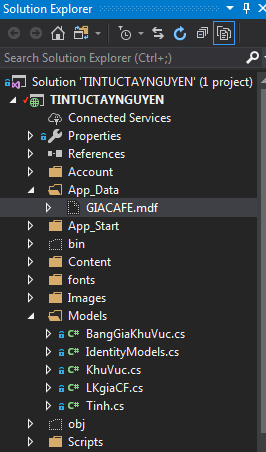
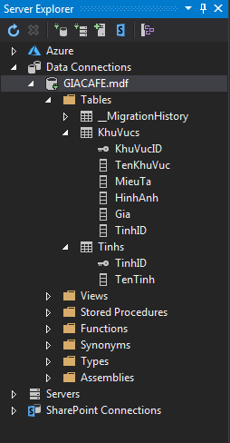
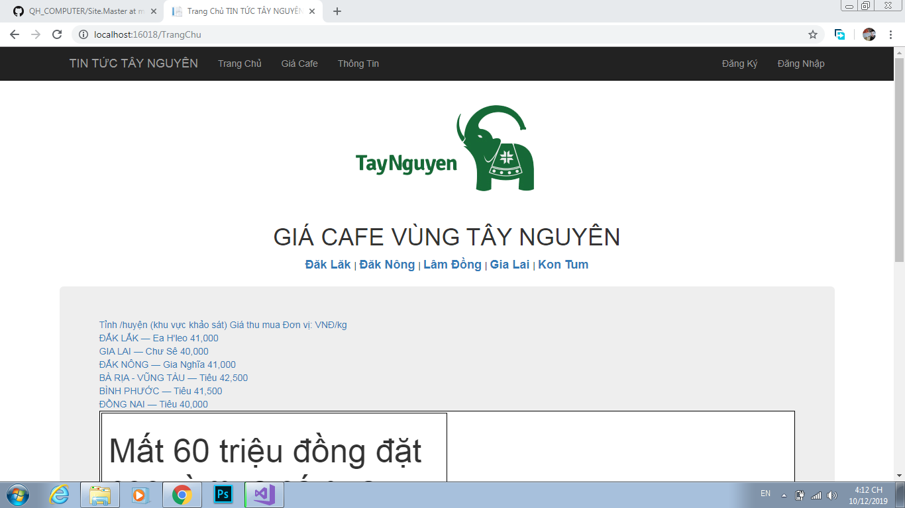
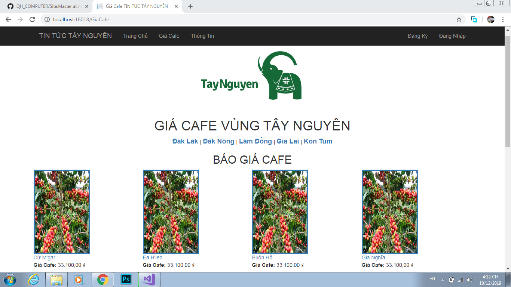
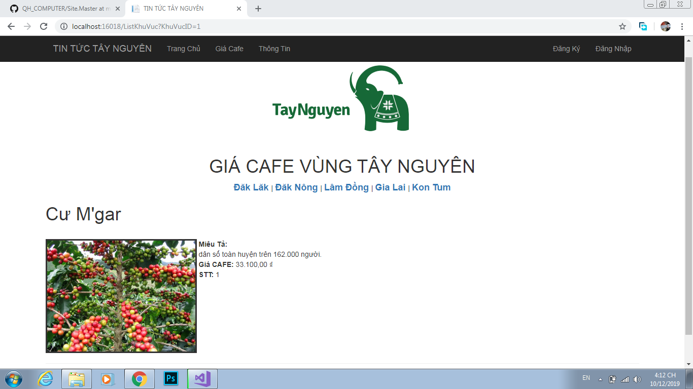
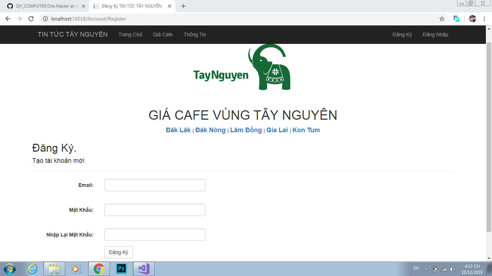
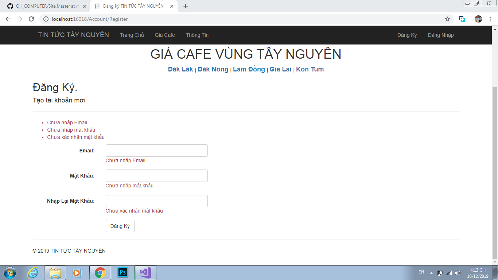
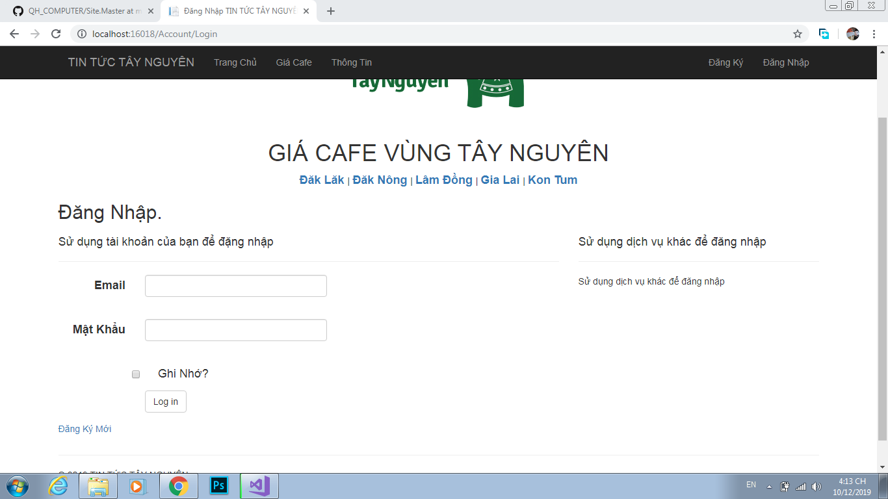
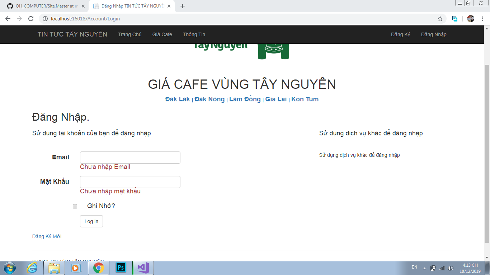

### Cơ Sở Dữ Liệu
*Xem và chỉnh sữa dữ liệu tiện lợi và nhanh chóng*

 

*Liên kết dữ liệu hợp lý và dễ chỉnh sửa khi không may gặp sự cố*

# Trang Chủ

*Giao diện dễ nhìn các bản tin khi mới vô web*

# Tin Giá Cafe

*Nội dung cho ta thấy toàn bộ những giá cả thị trường trong ngày và từng vùng miền Tây Nguyên*

*Thể hiện rõ được đặc điểm từng khu vực*

# Đăng Ký

*Không những đăng ký nhanh và bắt lỗi đăng ký sai tốt*

# Đăng Nhập

*Bạn phải có tài khoản của web mới nhận được thông báo mới nhất về giá Cafe*

